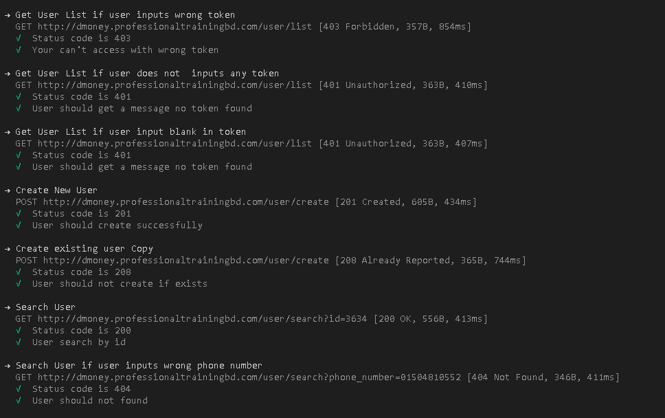
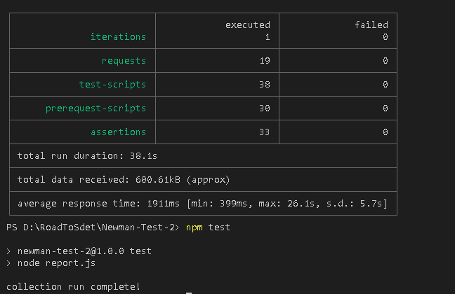

 # Dmoney-API-Collection-Newman 
 # API Testing with Postman + Report Generate with Newman 

     1.https://documenter.getpostman.com/view/21487211/UzBqqRiG

 # How to run this project
     1.Clone this project 
     2.Open with any code editor (Ex-VS Code) and open terminal inside the project folder
     3.Give the following command
     4.Only run collection json file you should following the command below
     5.npm i newman (npm install)
     6.npx newman run .\collection\DmoneyCollection.json
     7.npm test

# Reports Preview are given below:
# Run Collection Using Newman:

   
# HTML Report Generate Using Newman:
  
 
 

